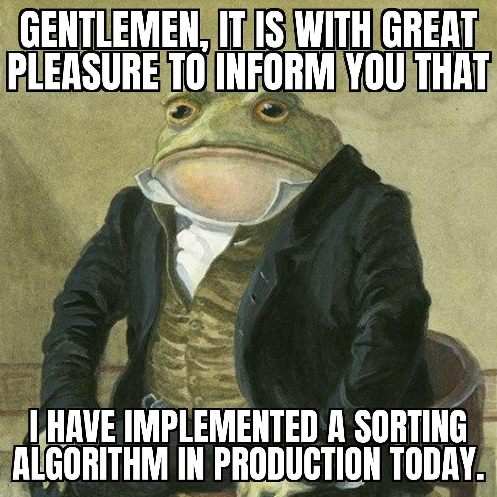

# The Swapping Grounds
Hand crafting sorting algorithms from scratch because relying on optimized built-in functions is a skill issue.

## What's in here

This repo is a tiny playground for implementing classic sorting algorithms by hand and comparing approaches.